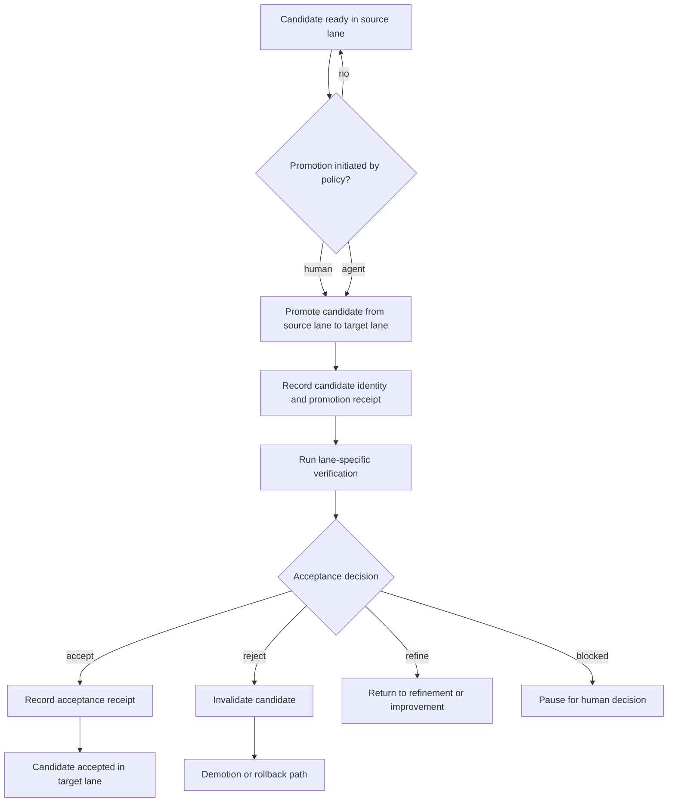

# Release agent contract

This document describes the operator-facing contract for the DevClaw release agent.

Use it as the manual for how release promotion and acceptance are meant to work.

## Core idea

Release is a distinct process from implementation, review, and testing.

- Development answers: was the change built correctly?
- Review answers: is the code acceptable?
- Testing answers: does it behave technically as expected?
- Release answers: should this exact candidate move from one lane to another, and can we prove that it did?

Release initiation should be **policy-controlled**, not automatic. Like PR handling, it may be human-initiated or agent-initiated depending on project policy.

## Flow

## Required concepts

### 1. Lanes are project-defined

Projects define release lanes or environments structurally in config.

Examples might be `dev`, `staging`, `production`, `local-current`, or something project-specific, but DevClaw core does not hardcode those names.

### 2. Promotion is source to target

Promotion means moving an exact candidate from one named lane to another named lane.

A promotion request identifies at minimum:
- the candidate
- the source lane
- the target lane
- the promotion policy or type

### 3. Candidate identity is mandatory

A promoted candidate is tied to an exact identity, such as:
- commit SHA
- PR URL
- branch
- tag, version, build id, or artifact id when relevant

### 4. Proof of release is mandatory

The release agent proves that it released the intended version.

Minimum proof includes:
- source candidate identity
- source lane
- target lane
- resulting target identity or target state
- verification evidence that the destination matches the intended candidate

Core rule:

> Prove source identity, prove destination identity, prove they match the intended promotion.

### 5. Acceptance is candidate-specific

Acceptance applies to a specific promoted candidate, not the issue in general.

Acceptance records:
- who accepted it
- where it was accepted
- what evidence was used
- what exact candidate was accepted

### 6. Acceptance defaults should be strong but configurable

Default acceptance criteria:
- candidate identity present
- source lane and target lane recorded
- proof of target state present
- required checks or evidence attached
- accepter identity recorded
- explicit outcome recorded

Projects can override:
- who can accept
- required evidence
- required checks
- allowed outcomes
- per-lane rules

### 7. Acceptance outcomes should be explicit

Standard outcomes:
- `accept`
- `reject`
- `refine`
- `blocked`

Rejecting acceptance invalidates the candidate, not just vaguely reopens the issue.

### 8. Rollback and demotion must be explicit

If a promoted candidate fails acceptance or later validation, the system explicitly marks it invalid and records the demotion or rollback path.

### 9. Preconditions and repeat behavior must be defined

The contract defines:
- what must already be true before promotion is allowed
- what should happen on repeated promotion attempts
  - no-op
  - retry
  - replace candidate
  - require explicit override

## Config versus prompts

This contract lives primarily in project config and workflow semantics, not only in prompts.

Prompts can explain how a project uses the release agent, but they are not the sole source of truth for:
- lane names
- allowed promotion paths
- acceptance authority
- required evidence
- lane-specific rules

## Operator checklist

A usable release-agent project setup defines at least:
- release lanes or environments
- allowed promotion paths between lanes
- candidate identity requirements
- proof-of-release requirements
- acceptance authority and outcomes
- rollback or demotion behavior
- preconditions for promotion
- retry and override behavior for repeated promotions
